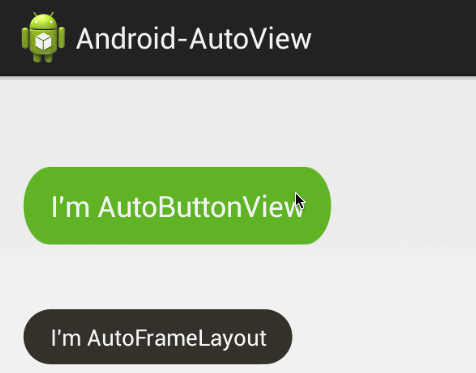

# Android-AutoView

只需要为View设置一张背景图片，就能够在被点击的时候加上点击效果。

##用法

###在grdle中导入

    compile 'me.biubiubiu.autoview:library:1.0.0'

###在xml中配置

    <me.biubiubiu.autoview.library.AutoButtonView
        android:text="I'm AutoButtonView"
        android:background="@drawable/bg_green_button"
        android:textColor="#fff"
        android:layout_marginTop="40dip"
        android:layout_width="wrap_content"
        android:layout_height="wrap_content"/>
       
       
**这里面的`@drawable/bg_green_button`是一张png图片，并不是一个xml文件。**

##demo

[下载地址](http://pan.baidu.com/s/1eQiTHM6)
